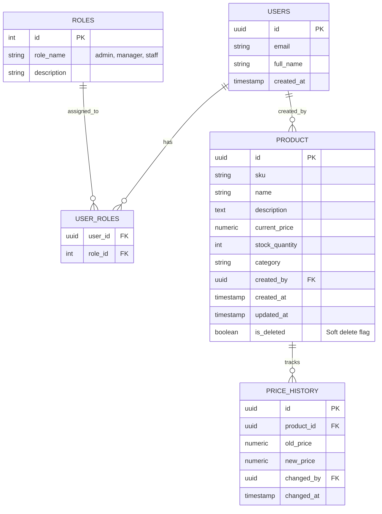

# Entity Relationship Diagram (ERD) - HopePMS

This documentation outlines the database schema architecture for the ProdSync application implemented within Supabase (PostgreSQL).

## ERD Diagram

## Schema Details
- **USERS**: Managed directly by Supabase Auth (`auth.users`), augmented with triggers for public profiles.
- **PRODUCT**: Implements soft-delete via `is_deleted` flag for Sprint 2. Protected by Row Level Security (RLS).
- **PRICE_HISTORY**: Automatically logs changes to `current_price` from the `PRODUCT` table to support Sprint 2 auditing requirements.
